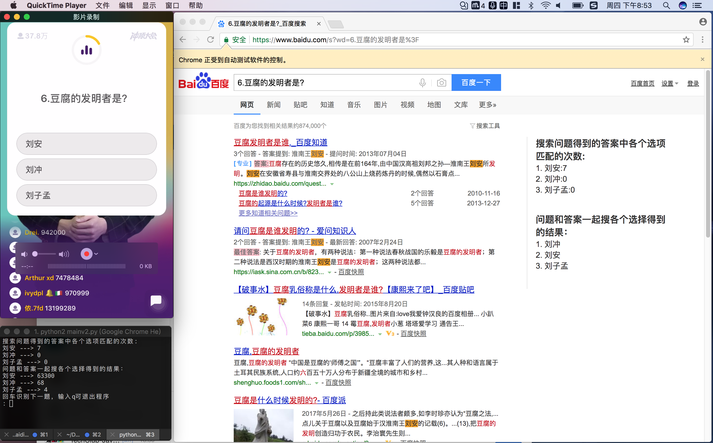

# 《冲顶大会》《西瓜视频》《UC全民答题》《芝士超人》辅助神器

12到题明明只差一道是不是很气，别着急，本神器来帮忙

### 1.安装

这个小程序是用Python写的，所以要先安装Python，安装好Python后要再安装两个Python包：

```shell
sudo pip install Pillow   # 画图用的
sudo pip install baidu-aip # 百度提供的OCR API
sudo pip install selenium # 浏览器测试控制   //把本项目跟目录下的chromedriver 放在环境变量里，让selenium可以调用到
```

另外，程序的原理是在屏幕上截图，把图片对应位置图片截取，调用OCR生成文字。然后搜索文字

所以要把手机投射到电脑屏幕上，MAC上使用`QuickTime player`很简单，Window上工具那就更多了自己找一个。

### 2.运行

按照下图所示排列好 `手机屏幕投影软件`   `浏览器`  `终端`



在终端执行：

```shell
python mainv2.py     // 冲顶大会高级版
python mainxgv2.py   // 西瓜视频高级版
python mainzsv2.py   // 知识超人高级版
python mainucv2.py   // UC全民答题高级版
```

认真玩游戏，当题目出现时，按一下回车，在中间的浏览器上就会自动搜索了。

### 3.注意事项

> 需要注意回答每道题时浏览器自动打开搜索，这个搜索中的结果比较可靠。如果来不及看再使用终端推荐的结果。输入任意字符可搜搜下一题。输入q退出程序。  可以实现执行run.ipynb看一下问题和答案在自己电脑上标注位置对不对，如果不对自己改一下坐标

```python
# 在文件中修改下面数组可改位置
questionBox = [40,235,675,285] # x,y,w,h
answerABox = [105,536,530,89] # x,y,w,h
```

> OCR用到了百度OCR API，大家要申请一个key，在plotimg.py中配置一些就行

```
APP_ID = 'XXXX'
API_KEY = 'XXXXXXXXXXXXXXXX'
SECRET_KEY = 'XXXXXXXXXXXXXXX'
```


OJBK，  好好赚钱吧~


